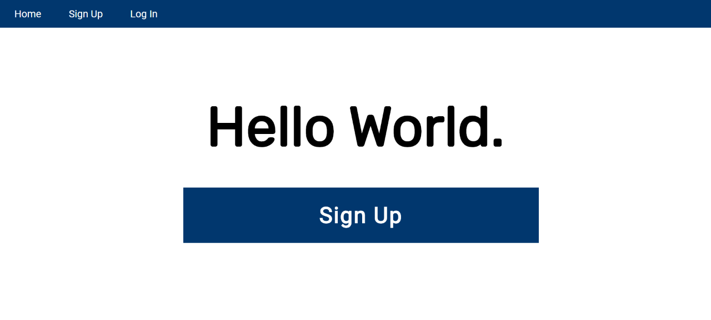
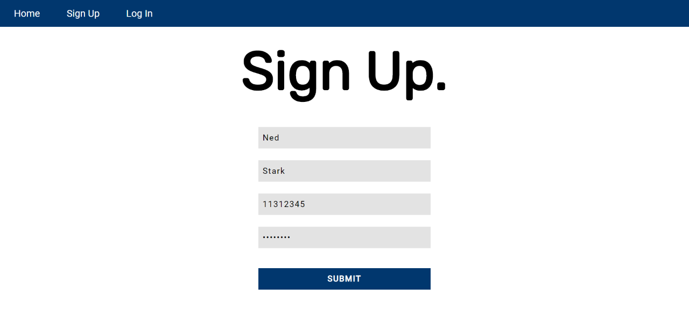

# ccapdev-hashing
bcrypt Tutorial for CCAPDEV1920T2

This repository will help you integrate hashing to your web applications using [bcrypt](https://www.npmjs.com/package/bcrypt). This web application is based on the previous [repository on client-side and server-side validation tutorial](https://github.com/arvention/ccapdev-validation). For this tutorial, we will use bcrypt to hash the password of the user before saving in the database.

## Contents:

Each folder and file in this repository is properly documented. You may read the `README.md` file of each folder to understand its content. You may also read the inline comments of each file explaining the statements line-per-line.

- [controllers](controllers) - This folder contains files which defines callback functions for client requests.
- [helpers](helpers) - This folder contains files which contains helper functions.
- [models](models) - This folder contains files for database modeling and access.
- [public](public) - This folder contains static assets such as css, js, and image files.
- [routes](routes) - This folder contains files which describes the response of the server for each HTTP method request to a specific path in the server.
- [views](views) - This folder contains all hbs files to be rendered when requested from the server.
- [index.js](index.js) - The main entry point of the web application.


## Follow the steps below to set-up and study this repository:
1. Clone the repository either by downloading the contents of the repository [here](https://github.com/arvention/ccapdev-hashing/archive/master.zip), or using the command below (Note: git should be installed in your system for this to work).
```
git clone https://github.com/arvention/ccapdev-hashing
```
2. Open Command Prompt
3. Navigate to the project folder - the folder containing the contents of the cloned or downloaded repository.
4. Run the command `npm install` to initialize and install all necessary modules used in the project.

5. We may now run our server. To do this, we run the command `node index.js`. Upon running the command, your Command Prompt should display the following statement:
```
app listening at port 9090
Connected to: mongodb://localhost:27017/ccapdev-hashing
```

6. Let's test our web application. Go to the link below to access the web application:
```
http://localhost:9090/
```

Your web browser should display the screen below:


7. Go to the sign-up page either using the menu item or the button. Enter sample user details as shown below. For the password, type the string `secretpw`, then submit the form.

The picture below shows a filled up sign-up form:


You will be redirected to a welcome page displaying the name and the link to your profile. However, let's focus on the database operation that we have performed in the background. To do this, check your command prompt and you'll see some statement printed like this:
```
Added {
    _id: 5e8dd5b6aff5d52eb8281ffc,
    fName: 'Ned',
    lName: 'Stark',
    idNum: 11312345,
    pw: '$2b$10$j7WfVMxLOInnsAS9DJI4T.GMi2jrBsxTSHffYeIZaOLT/tdIkajri'
}
```
Based on our [`models\db.js`](models\db.js) code, this statement is printed whenever we call its `insertOne()` function. It shows the values of the document that the web application has inserted to the database upon the submission of the sign-up form. The object contains 5 fields:
- `_id` - a primary key auto generated by MongoDB for the document
- `fName` - the first name entered by the user
- `lName` - the last name entered by the user
- `idNum` - the ID number entered by the user
- `pw` - the HASHED version of the password entered by the user

Notice that the values inserted to the database for the fields `fName`, `lName`, and `idNum` are equal to the `plaintext` values that we have indicated in the sign-up sheet. However, the value for the field `pw` is not equal to the value that we have provided in the sign-up sheet, i.e. `secretpw`. The value that we have stored in the database for the field `pw` is the HASHED version of the value that we have entered in the sign-up sheet. Do note that the value of the field `pw` in my example might be different from the value generated in your instance, but both values are still equal to the `plaintext` password `secretpw`. If you want to read more about this, here is a [link](https://codahale.com/how-to-safely-store-a-password/).

Hashing passwords in web applications is not only a good practice, but it is MANDATORY. This secures the credentials of the user from being exposed to developers and database administrators of the web application.

Now, how do we hash the password before actually saving it in the database?

```
postSignUp: function (req, res) {

    var errors = validationResult(req);

    if (!errors.isEmpty()) {

        errors = errors.errors;

        var details = {};
        for(i = 0; i < errors.length; i++)
            details[errors[i].param + 'Error'] = errors[i].msg;
        res.render('signup', details);
    }

    else {
        var fName = req.body.fName;
        var lName = req.body.lName;
        var idNum = req.body.idNum;
        var pw = req.body.pw;

        bcrypt.hash(pw, saltRounds, function(err, hash) {

            var user = {
                fName: fName,
                lName: lName,
                idNum: idNum,
                pw: hash
            }

            db.insertOne(User, user, function(flag) {
                if(flag) {
                    res.redirect('/success?fName=' + fName +'&lName=' + lName + '&idNum=' + idNum);
                }
            });
        });
    }
}
```
